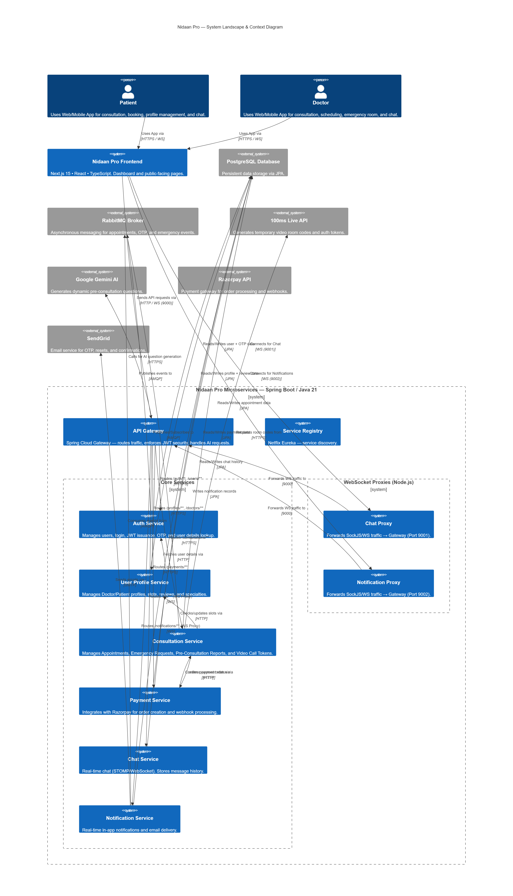
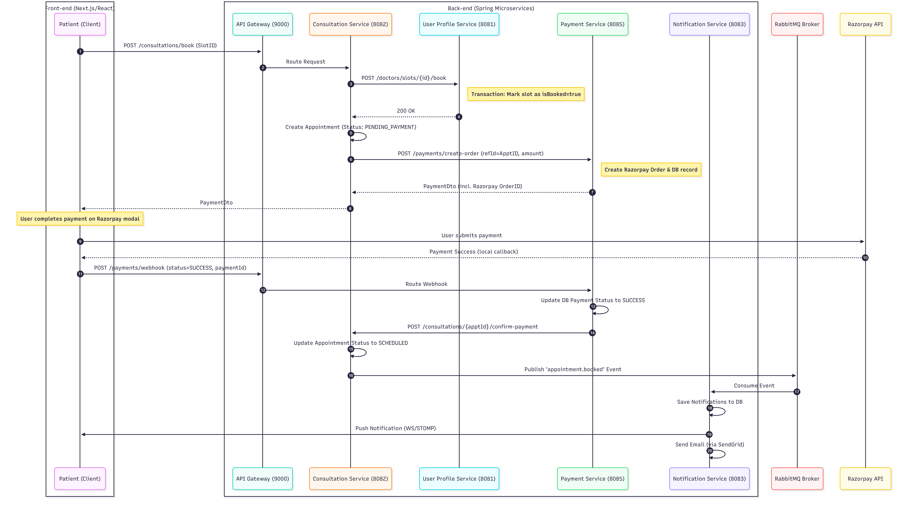
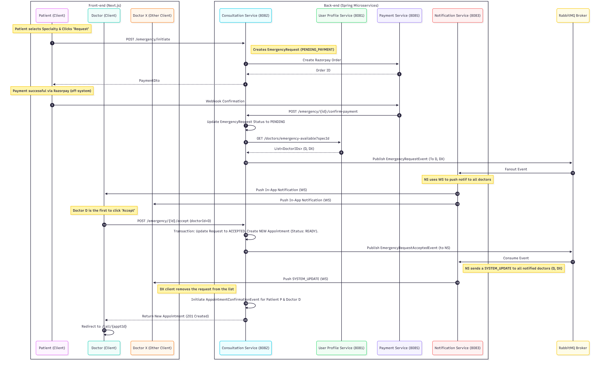
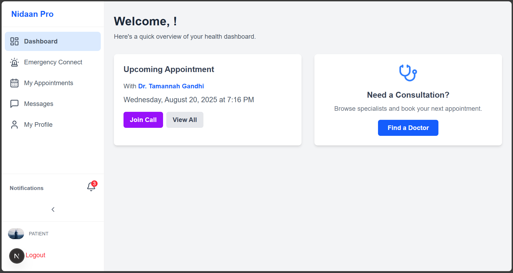
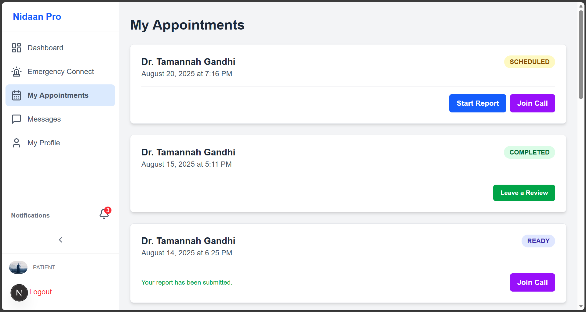
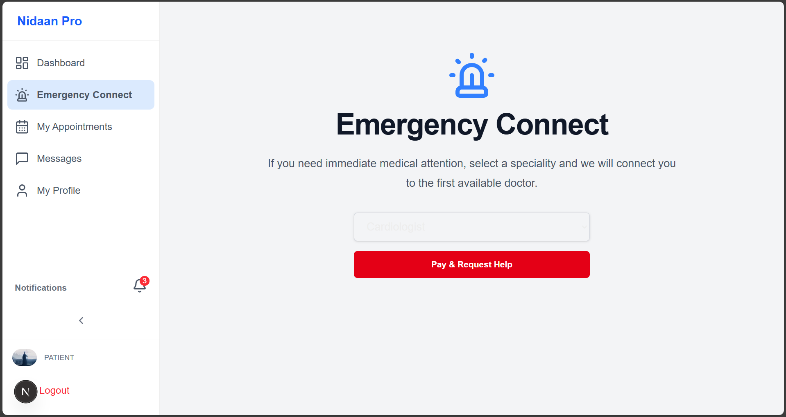
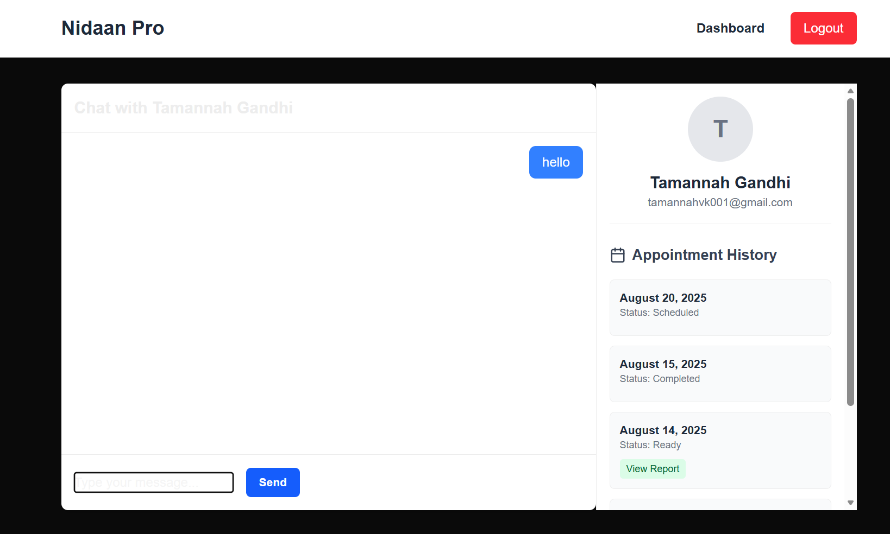
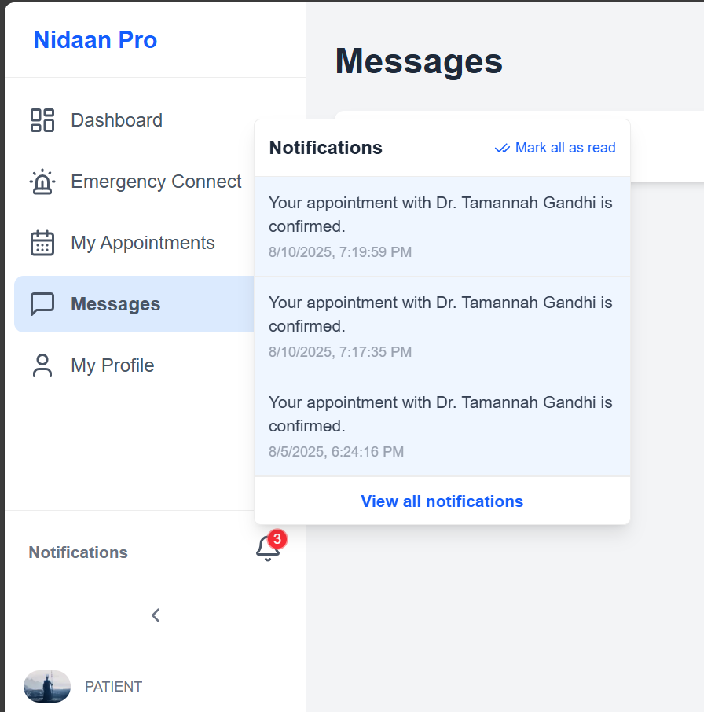
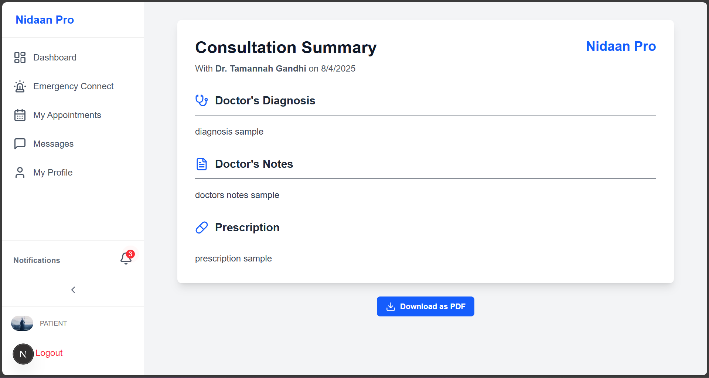
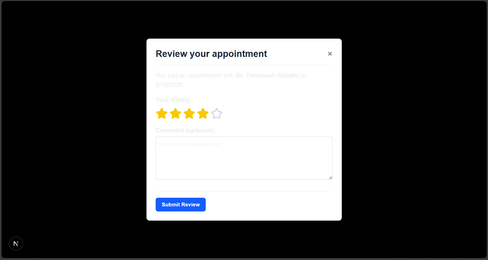

# Nidaan Pro: An AI-Powered Distributed Telemedicine Platform

A comprehensive, distributed telemedicine platform designed to bridge the gap between patients and doctors. Built on a robust microservices architecture, it offers a seamless and feature-rich experience for online consultations, from appointment booking and AI-driven pre-consultation to secure video calls and real-time communication.

---

## 🏗️ System Architecture Diagrams

Showcasing the core of Nidaan Pro's design. The platform is built on a scalable microservices architecture.

    
    
    

---

## 📸 Project Screenshots

Explore the user interface of Nidaan Pro.

    
    
    
    
    
    
    
    

---

✨ Core Features

🔐 User Authentication & Authorization: Secure, role-based (Patient/Doctor) authentication using JWT, with OTP-based registration and password reset.

👤 Comprehensive Profile Management: Dedicated profile management for both doctors and patients, including specializations, experience, and personal details.

📅 Appointment Booking System: An intuitive system for patients to find doctors, view their availability, and book appointments seamlessly.

🤖 AI-Powered Pre-consultation: An intelligent pre-consultation flow that gathers preliminary information from patients using AI-generated dynamic questions, saving valuable time during the consultation.

📡 Real-time Communication:

Chat Service: Real-time, one-on-one chat between doctors and patients.

Video Consultations: Secure, high-quality video calls for a face-to-face consultation experience.

🚑 Emergency Connect: A critical feature that connects patients with the first available doctor in case of an emergency.

💳 Payment Integration: Seamless payment processing for appointments and emergency consultations, powered by Razorpay.

🔔 Real-time Notifications: Instant in-app and email notifications for appointments, messages, and other important events.

⭐ Doctor Reviews and Ratings: A feedback system for patients to rate and review their consultation experience.

🏛️ System Architecture

Nidaan Pro is built on a microservices architecture, with each service designed to handle a specific business capability. This ensures scalability, resilience, and maintainability.

Service Discovery: Netflix Eureka is used for service registration and discovery, allowing services to locate and communicate with each other dynamically.

API Gateway: A single entry point for all client requests, handled by Spring Cloud Gateway. It's responsible for routing, authentication, and cross-cutting concerns.

Asynchronous Communication: RabbitMQ is used for asynchronous communication between services, ensuring loose coupling and improved fault tolerance.

▸ Click to view Microservices Overview

<table style="width:100%; border-collapse: collapse; background-color: #fff; border-radius: 8px; overflow: hidden;">
<thead>
<tr style="background-color: #e0e7ff;">
<th style="padding: 12px; border: 1px solid #c7d2fe; text-align: left;">Service</th>
<th style="padding: 12px; border: 1px solid #c7d2fe; text-align: left;">Description</th>
</tr>
</thead>
<tbody>
<tr>
<td style="padding: 12px; border: 1px solid #c7d2fe;"><strong><code>service-registry</code></strong></td>
<td style="padding: 12px; border: 1px solid #c7d2fe;">The Eureka server that manages the registration and discovery of all microservices.</td>
</tr>
<tr>
<td style="padding: 12px; border: 1px solid #c7d2fe;"><strong><code>api-gateway</code></strong></td>
<td style="padding: 12px; border: 1px solid #c7d2fe;">The single entry point for all incoming requests. It routes traffic to the appropriate service and handles JWT-based authentication.</td>
</tr>
<tr>
<td style="padding: 12px; border: 1px solid #c7d2fe;"><strong><code>auth-service</code></strong></td>
<td style="padding: 12px; border: 1px solid #c7d2fe;">Manages user authentication, registration with OTP verification, login, and password reset functionalities.</td>
</tr>
<tr>
<td style="padding: 12px; border: 1px solid #c7d2fe;"><strong><code>user-profile-service</code></strong></td>
<td style="padding: 12px; border: 1px solid #c7d2fe;">Handles the creation and management of detailed profiles for both patients and doctors, including specialities, availability, and reviews.</td>
</tr>
<tr>
<td style="padding: 12px; border: 1px solid #c7d2fe;"><strong><code>consultation-service</code></strong></td>
<td style="padding: 12px; border: 1px solid #c7d2fe;">The core service that orchestrates appointments, pre-consultation reports, emergency requests, and video call integration.</td>
</tr>
<tr>
<td style="padding: 12px; border: 1px solid #c7d2fe;"><strong><code>notification-service</code></strong></td>
<td style="padding: 12px; border: 1px solid #c7d2fe;">Responsible for sending real-time in-app notifications (via WebSockets) and email notifications for various events.</td>
</tr>
<tr>
<td style="padding: 12px; border: 1px solid #c7d2fe;"><strong><code>chat-service</code></strong></td>
<td style="padding: 12px; border: 1px solid #c7d2fe;">A real-time chat service that enables one-on-one communication between patients and doctors using STOMP over WebSockets.</td>
</tr>
<tr>
<td style="padding: 12px; border: 1px solid #c7d2fe;"><strong><code>payment-service</code></strong></td>
<td style="padding: 12px; border: 1px solid #c7d2fe;">Integrates with Razorpay to manage payments for appointments and other services.</td>
</tr>
</tbody>
</table>

💻 Tech Stack

▸ Click to view the full Technology Stack

Backend

Java 21 & Spring Boot 3

Spring Cloud (Gateway, Eureka)

Spring Data JPA (Hibernate)

PostgreSQL

RabbitMQ (for asynchronous communication)

WebSocket (STOMP) (for real-time chat and notifications)

Maven (for dependency management)

Docker (for containerization)

Frontend

Next.js 15 & React 18

TypeScript

Tailwind CSS

Axios

Socket.IO / STOMP.js

DevOps & Third-party Services

Git & GitHub

Razorpay (for payments)

SendGrid (for emails)

Google Gemini AI (for AI-powered pre-consultation)

🚀 Getting Started

To get the project up and running locally, you'll need to have Java, Node.js, and Docker installed.

Environment Variables

To run this project, you will need to add the following environment variables to your .env file (or application-secrets.properties in the Spring Boot projects).

# Database Configuration
SPRING_DATASOURCE_URL=your_database_url
DB_USERNAME=your_db_username
DB_PASSWORD=your_db_password

# Security
JWT_SECRET=your_jwt_secret

# Third-Party APIs
RAZORPAY_KEY_ID=your_razorpay_key_id
RAZORPAY_KEY_SECRET=your_razorpay_key_secret
SENDGRID_API_KEY=your_sendgrid_api_key
GEMINI_API_KEY=your_gemini_api_key
HMS_MANAGEMENT_TOKEN=your_hms_management_token

📖 API Endpoints

Auth Service (:8080)

<table style="width:100%; border-collapse: collapse; background-color: #fff; border-radius: 8px; overflow: hidden; margin-top: 1rem;">
<thead>
<tr style="background-color: #f0f2ff;">
<th style="padding: 12px; border: 1px solid #ddd; text-align: left; width: 100px;">Method</th>
<th style="padding: 12px; border: 1px solid #ddd; text-align: left; width: 350px;">Endpoint</th>
<th style="padding: 12px; border: 1px solid #ddd; text-align: left;">Description</th>
</tr>
</thead>
<tbody>
<tr>
<td style="padding: 12px; border: 1px solid #ddd;"><code style="background-color: #28a745; color: white; padding: 2px 6px; border-radius: 4px; font-weight: bold;">POST</code></td>
<td style="padding: 12px; border: 1px solid #ddd;"><code>/api/auth/register/request-otp</code></td>
<td style="padding: 12px; border: 1px solid #ddd;">Request an OTP for registration</td>
</tr>
<tr>
<td style="padding: 12px; border: 1px solid #ddd;"><code style="background-color: #28a745; color: white; padding: 2px 6px; border-radius: 4px; font-weight: bold;">POST</code></td>
<td style="padding: 12px; border: 1px solid #ddd;"><code>/api/auth/register/verify</code></td>
<td style="padding: 12px; border: 1px solid #ddd;">Verify OTP and register a user</td>
</tr>
<tr>
<td style="padding: 12px; border: 1px solid #ddd;"><code style="background-color: #28a745; color: white; padding: 2px 6px; border-radius: 4px; font-weight: bold;">POST</code></td>
<td style="padding: 12px; border: 1px solid #ddd;"><code>/api/auth/login</code></td>
<td style="padding: 12px; border: 1px solid #ddd;">Log in a user</td>
</tr>
<tr>
<td style="padding: 12px; border: 1px solid #ddd;"><code style="background-color: #28a745; color: white; padding: 2px 6px; border-radius: 4px; font-weight: bold;">POST</code></td>
<td style="padding: 12px; border: 1px solid #ddd;"><code>/api/auth/forgot-password</code></td>
<td style="padding: 12px; border: 1px solid #ddd;">Request a password reset token</td>
</tr>
<tr>
<td style="padding: 12px; border: 1px solid #ddd;"><code style="background-color: #28a745; color: white; padding: 2px 6px; border-radius: 4px; font-weight: bold;">POST</code></td>
<td style="padding: 12px; border: 1px solid #ddd;"><code>/api/auth/reset-password</code></td>
<td style="padding: 12px; border: 1px solid #ddd;">Reset a user's password</td>
</tr>
<tr>
<td style="padding: 12px; border: 1px solid #ddd;"><code style="background-color: #28a745; color: white; padding: 2px 6px; border-radius: 4px; font-weight: bold;">POST</code></td>
<td style="padding: 12px; border: 1px solid #ddd;"><code>/api/users/details</code></td>
<td style="padding: 12px; border: 1px solid #ddd;">Get details for a list of users</td>
</tr>
</tbody>
</table>

User Profile Service (:8081)

<table style="width:100%; border-collapse: collapse; background-color: #fff; border-radius: 8px; overflow: hidden; margin-top: 1rem;">
<thead>
<tr style="background-color: #f0f2ff;">
<th style="padding: 12px; border: 1px solid #ddd; text-align: left; width: 100px;">Method</th>
<th style="padding: 12px; border: 1px solid #ddd; text-align: left; width: 350px;">Endpoint</th>
<th style="padding: 12px; border: 1px solid #ddd; text-align: left;">Description</th>
</tr>
</thead>
<tbody>
<tr>
<td style="padding: 12px; border: 1px solid #ddd;"><code style="background-color: #28a745; color: white; padding: 2px 6px; border-radius: 4px; font-weight: bold;">POST</code></td>
<td style="padding: 12px; border: 1px solid #ddd;"><code>/api/profiles/doctor</code></td>
<td style="padding: 12px; border: 1px solid #ddd;">Create or update a doctor's profile</td>
</tr>
<tr>
<td style="padding: 12px; border: 1px solid #ddd;"><code style="background-color: #28a745; color: white; padding: 2px 6px; border-radius: 4px; font-weight: bold;">POST</code></td>
<td style="padding: 12px; border: 1px solid #ddd;"><code>/api/profiles/patient</code></td>
<td style="padding: 12px; border: 1px solid #ddd;">Create or update a patient's profile</td>
</tr>
<tr>
<td style="padding: 12px; border: 1px solid #ddd;"><code style="background-color: #007bff; color: white; padding: 2px 6px; border-radius: 4px; font-weight: bold;">GET</code></td>
<td style="padding: 12px; border: 1px solid #ddd;"><code>/api/profiles/{userId}</code></td>
<td style="padding: 12px; border: 1px solid #ddd;">Get a user's profile by their ID</td>
</tr>
<tr>
<td style="padding: 12px; border: 1px solid #ddd;"><code style="background-color: #007bff; color: white; padding: 2px 6px; border-radius: 4px; font-weight: bold;">GET</code></td>
<td style="padding: 12px; border: 1px solid #ddd;"><code>/api/specialities</code></td>
<td style="padding: 12px; border: 1px solid #ddd;">Get a list of all medical specialities</td>
</tr>
<tr>
<td style="padding: 12px; border: 1px solid #ddd;"><code style="background-color: #28a745; color: white; padding: 2px 6px; border-radius: 4px; font-weight: bold;">POST</code></td>
<td style="padding: 12px; border: 1px solid #ddd;"><code>/api/specialities</code></td>
<td style="padding: 12px; border: 1px solid #ddd;">Create a new medical speciality</td>
</tr>
<tr>
<td style="padding: 12px; border: 1px solid #ddd;"><code style="background-color: #007bff; color: white; padding: 2px 6px; border-radius: 4px; font-weight: bold;">GET</code></td>
<td style="padding: 12px; border: 1px solid #ddd;"><code>/api/doctors</code></td>
<td style="padding: 12px; border: 1px solid #ddd;">Get a list of all doctors</td>
</tr>
<tr>
<td style="padding: 12px; border: 1px solid #ddd;"><code style="background-color: #28a745; color: white; padding: 2px 6px; border-radius: 4px; font-weight: bold;">POST</code></td>
<td style="padding: 12px; border: 1px solid #ddd;"><code>/api/doctors/{doctorId}/slots</code></td>
<td style="padding: 12px; border: 1px solid #ddd;">Add a new availability slot for a doctor</td>
</tr>
<tr>
<td style="padding: 12px; border: 1px solid #ddd;"><code style="background-color: #007bff; color: white; padding: 2px 6px; border-radius: 4px; font-weight: bold;">GET</code></td>
<td style="padding: 12px; border: 1px solid #ddd;"><code>/api/doctors/{doctorId}/slots</code></td>
<td style="padding: 12px; border: 1px solid #ddd;">Get a doctor's available slots</td>
</tr>
<tr>
<td style="padding: 12px; border: 1px solid #ddd;"><code style="background-color: #28a745; color: white; padding: 2px 6px; border-radius: 4px; font-weight: bold;">POST</code></td>
<td style="padding: 12px; border: 1px solid #ddd;"><code>/api/reviews</code></td>
<td style="padding: 12px; border: 1px solid #ddd;">Submit a review for a doctor</td>
</tr>
<tr>
<td style="padding: 12px; border: 1px solid #ddd;"><code style="background-color: #007bff; color: white; padding: 2px 6px; border-radius: 4px; font-weight: bold;">GET</code></td>
<td style="padding: 12px; border: 1px solid #ddd;"><code>/api/reviews/doctor/{doctorId}</code></td>
<td style="padding: 12px; border: 1px solid #ddd;">Get all reviews for a doctor</td>
</tr>
</tbody>
</table>

Consultation Service (:8082)

<table style="width:100%; border-collapse: collapse; background-color: #fff; border-radius: 8px; overflow: hidden; margin-top: 1rem;">
<thead>
<tr style="background-color: #f0f2ff;">
<th style="padding: 12px; border: 1px solid #ddd; text-align: left; width: 100px;">Method</th>
<th style="padding: 12px; border: 1px solid #ddd; text-align: left; width: 350px;">Endpoint</th>
<th style="padding: 12px; border: 1px solid #ddd; text-align: left;">Description</th>
</tr>
</thead>
<tbody>
<tr>
<td style="padding: 12px; border: 1px solid #ddd;"><code style="background-color: #28a745; color: white; padding: 2px 6px; border-radius: 4px; font-weight: bold;">POST</code></td>
<td style="padding: 12px; border: 1px solid #ddd;"><code>/api/consultations/book</code></td>
<td style="padding: 12px; border: 1px solid #ddd;">Book a new appointment</td>
</tr>
<tr>
<td style="padding: 12px; border: 1px solid #ddd;"><code style="background-color: #007bff; color: white; padding: 2px 6px; border-radius: 4px; font-weight: bold;">GET</code></td>
<td style="padding: 12px; border: 1px solid #ddd;"><code>/api/consultations/patient/{patientId}</code></td>
<td style="padding: 12px; border: 1px solid #ddd;">Get all appointments for a patient</td>
</tr>
<tr>
<td style="padding: 12px; border: 1px solid #ddd;"><code style="background-color: #007bff; color: white; padding: 2px 6px; border-radius: 4px; font-weight: bold;">GET</code></td>
<td style="padding: 12px; border: 1px solid #ddd;"><code>/api/consultations/doctor/{doctorId}</code></td>
<td style="padding: 12px; border: 1px solid #ddd;">Get all appointments for a doctor</td>
</tr>
<tr>
<td style="padding: 12px; border: 1px solid #ddd;"><code style="background-color: #28a745; color: white; padding: 2px 6px; border-radius: 4px; font-weight: bold;">POST</code></td>
<td style="padding: 12px; border: 1px solid #ddd;"><code>/api/consultations/reports</code></td>
<td style="padding: 12px; border: 1px solid #ddd;">Submit a pre-consultation report</td>
</tr>
<tr>
<td style="padding: 12px; border: 1px solid #ddd;"><code style="background-color: #007bff; color: white; padding: 2px 6px; border-radius: 4px; font-weight: bold;">GET</code></td>
<td style="padding: 12px; border: 1px solid #ddd;"><code>/api/consultations/reports/appointment/{appointmentId}</code></td>
<td style="padding: 12px; border: 1px solid #ddd;">Get a pre-consultation report</td>
</tr>
<tr>
<td style="padding: 12px; border: 1px solid #ddd;"><code style="background-color: #007bff; color: white; padding: 2px 6px; border-radius: 4px; font-weight: bold;">GET</code></td>
<td style="padding: 12px; border: 1px solid #ddd;"><code>/api/consultations/chat-partners/{userId}</code></td>
<td style="padding: 12px; border: 1px solid #ddd;">Get a list of users the user can chat with</td>
</tr>
<tr>
<td style="padding: 12px; border: 1px solid #ddd;"><code style="background-color: #28a745; color: white; padding: 2px 6px; border-radius: 4px; font-weight: bold;">POST</code></td>
<td style="padding: 12px; border: 1px solid #ddd;"><code>/api/consultations/emergency/initiate</code></td>
<td style="padding: 12px; border: 1px solid #ddd;">Initiate an emergency consultation</td>
</tr>
<tr>
<td style="padding: 12px; border: 1px solid #ddd;"><code style="background-color: #007bff; color: white; padding: 2px 6px; border-radius: 4px; font-weight: bold;">GET</code></td>
<td style="padding: 12px; border: 1px solid #ddd;"><code>/api/consultations/emergency/pending</code></td>
<td style="padding: 12px; border: 1px solid #ddd;">Get pending emergency requests</td>
</tr>
<tr>
<td style="padding: 12px; border: 1px solid #ddd;"><code style="background-color: #28a745; color: white; padding: 2px 6px; border-radius: 4px; font-weight: bold;">POST</code></td>
<td style="padding: 12px; border: 1px solid #ddd;"><code>/api/consultations/emergency/{requestId}/accept</code></td>
<td style="padding: 12px; border: 1px solid #ddd;">Accept an emergency request</td>
</tr>
</tbody>
</table>

Notification Service (:8083)

<table style="width:100%; border-collapse: collapse; background-color: #fff; border-radius: 8px; overflow: hidden; margin-top: 1rem;">
<thead>
<tr style="background-color: #f0f2ff;">
<th style="padding: 12px; border: 1px solid #ddd; text-align: left; width: 100px;">Method</th>
<th style="padding: 12px; border: 1px solid #ddd; text-align: left; width: 350px;">Endpoint</th>
<th style="padding: 12px; border: 1px solid #ddd; text-align: left;">Description</th>
</tr>
</thead>
<tbody>
<tr>
<td style="padding: 12px; border: 1px solid #ddd;"><code style="background-color: #007bff; color: white; padding: 2px 6px; border-radius: 4px; font-weight: bold;">GET</code></td>
<td style="padding: 12px; border: 1px solid #ddd;"><code>/api/notifications/{userId}</code></td>
<td style="padding: 12px; border: 1px solid #ddd;">Get all notifications for a user</td>
</tr>
<tr>
<td style="padding: 12px; border: 1px solid #ddd;"><code style="background-color: #28a745; color: white; padding: 2px 6px; border-radius: 4px; font-weight: bold;">POST</code></td>
<td style="padding: 12px; border: 1px solid #ddd;"><code>/api/notifications/{userId}/mark-as-read</code></td>
<td style="padding: 12px; border: 1px solid #ddd;">Mark all notifications as read</td>
</tr>
</tbody>
</table>

Chat Service (:8084)

<table style="width:100%; border-collapse: collapse; background-color: #fff; border-radius: 8px; overflow: hidden; margin-top: 1rem;">
<thead>
<tr style="background-color: #f0f2ff;">
<th style="padding: 12px; border: 1px solid #ddd; text-align: left; width: 100px;">Method</th>
<th style="padding: 12px; border: 1px solid #ddd; text-align: left; width: 350px;">Endpoint</th>
<th style="padding: 12px; border: 1px solid #ddd; text-align: left;">Description</th>
</tr>
</thead>
<tbody>
<tr>
<td style="padding: 12px; border: 1px solid #ddd;"><code style="background-color: #6f42c1; color: white; padding: 2px 6px; border-radius: 4px; font-weight: bold;">WebSocket</code></td>
<td style="padding: 12px; border: 1px solid #ddd;"><code>/chat</code></td>
<td style="padding: 12px; border: 1px solid #ddd;">Send a real-time chat message</td>
</tr>
<tr>
<td style="padding: 12px; border: 1px solid #ddd;"><code style="background-color: #007bff; color: white; padding: 2px 6px; border-radius: 4px; font-weight: bold;">GET</code></td>
<td style="padding: 12px; border: 1px solid #ddd;"><code>/api/chat/history</code></td>
<td style="padding: 12px; border: 1px solid #ddd;">Get the chat history between two users</td>
</tr>
</tbody>
</table>

Payment Service (:8085)

<table style="width:100%; border-collapse: collapse; background-color: #fff; border-radius: 8px; overflow: hidden; margin-top: 1rem;">
<thead>
<tr style="background-color: #f0f2ff;">
<th style="padding: 12px; border: 1px solid #ddd; text-align: left; width: 100px;">Method</th>
<th style="padding: 12px; border: 1px solid #ddd; text-align: left; width: 350px;">Endpoint</th>
<th style="padding: 12px; border: 1px solid #ddd; text-align: left;">Description</th>
</tr>
</thead>
<tbody>
<tr>
<td style="padding: 12px; border: 1px solid #ddd;"><code style="background-color: #28a745; color: white; padding: 2px 6px; border-radius: 4px; font-weight: bold;">POST</code></td>
<td style="padding: 12px; border: 1px solid #ddd;"><code>/api/payments/create-order</code></td>
<td style="padding: 12px; border: 1px solid #ddd;">Creates a new payment order</td>
</tr>
<tr>
<td style="padding: 12px; border: 1px solid #ddd;"><code style="background-color: #28a745; color: white; padding: 2px 6px; border-radius: 4px; font-weight: bold;">POST</code></td>
<td style="padding: 12px; border: 1px solid #ddd;"><code>/api/payments/webhook</code></td>
<td style="padding: 12px; border: 1px solid #ddd;">Handles payment status updates</td>
</tr>
</tbody>
</table>

API Gateway (:9000)

<table style="width:100%; border-collapse: collapse; background-color: #fff; border-radius: 8px; overflow: hidden; margin-top: 1rem;">
<thead>
<tr style="background-color: #f0f2ff;">
<th style="padding: 12px; border: 1px solid #ddd; text-align: left; width: 100px;">Method</th>
<th style="padding: 12px; border: 1px solid #ddd; text-align: left; width: 350px;">Endpoint</th>
<th style="padding: 12px; border: 1px solid #ddd; text-align: left;">Description</th>
</tr>
</thead>
<tbody>
<tr>
<td style="padding: 12px; border: 1px solid #ddd;"><code style="background-color: #28a745; color: white; padding: 2px 6px; border-radius: 4px; font-weight: bold;">POST</code></td>
<td style="padding: 12px; border: 1px solid #ddd;"><code>/api/ai/dynamic-questions</code></td>
<td style="padding: 12px; border: 1px solid #ddd;">Generates dynamic follow-up questions using AI</td>
</tr>
</tbody>
</table>

📜 License

This project is licensed under the MIT License - see the LICENSE file for details.

